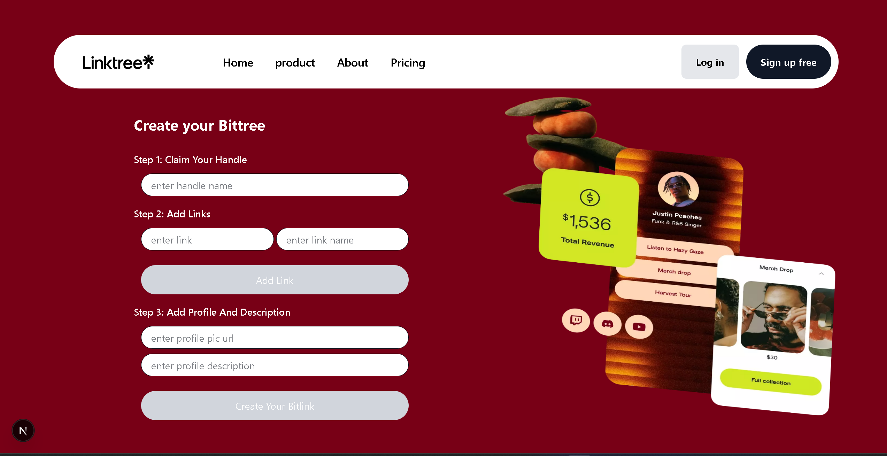

# 🌿 LinkTree Clone

A simple and customizable **LinkTree Clone** built using **Next.js (App Router)**, **Tailwind CSS**, and **JavaScript**.

## ✨ Features

- 🔗 Create your own LinkTree page to showcase all your important links in one place.
- 📄 Share your personalized page link in your social media bios (Instagram, Twitter, etc.).
- ⚡ Fast using Next.js App Router.
- 🎨 Built with Tailwind CSS for utility-first styling.

## 🖼️ Screenshot

### Project View



---

## 🚀 Getting Started

### 1. Clone the repository

```bash
git clone https://github.com/Manoj-kumar-gs/LinkTree-clone.git

2. Install dependencies:
npm install

3. Configure environment variables:
Create a .env.local file in the root directory and add your MongoDB connection string:
MONGODB_URI=your-mongodb-connection-string

4. Run the development server
npm run dev

5. Open http://localhost:3000 in your browser.

Tecnologies Used:
Next.js 15
MongoDB
Tailwind CSS